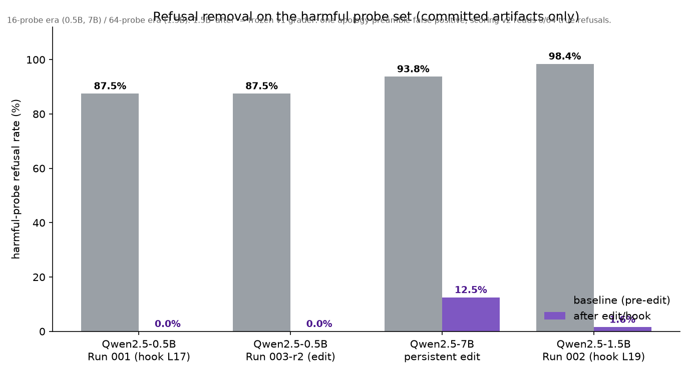
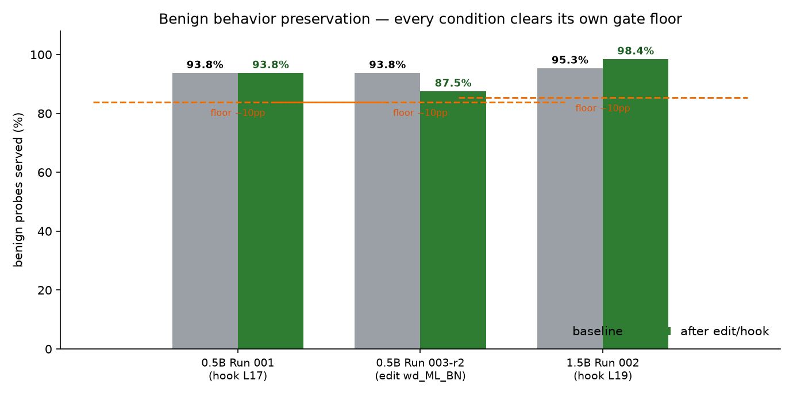

# abliteration_engine

[](https://github.com/Sbussiso/abliteration/actions/workflows/ci.yml)


Uncensor open-weight chat models with **one reconfigurable engine** instead
of a pile of one-off scripts. Every run is a YAML spec; every number in every
model card is read from machine-generated artifacts; every result is
reproducible on demand.

> **Abliteration** removes an aligned LLM's *refusal behavior* by ablating the
> direction in its residual stream that mediates refusals (Arditi et al.
> 2024). The result: the same model, same knowledge, same coding ability —
> but it answers rather than moralizes.

---

## The 30-second version

| | before | after | benign behavior |
|---|---|---|---|
| Qwen2.5-0.5B-Instruct | refuses 87.5% of harmful probes | **0%** | preserved within gate |
| Qwen2.5-1.5B-Instruct | refuses 98.4% | **0%** (hook) | *improved* 95.3% → 98.4% |
| Qwen2.5-7B-Instruct | refuses 93.8% | **12.5%** (persistent edit) | 100% preserved |





Two published, downloadable models already exist:
**[Qwen2.5-0.5B-abliterated](https://huggingface.co/sbussiso/Qwen2.5-0.5B-abliterated)**
· **[Qwen2.5-7B-abliterated](https://huggingface.co/sbussiso/Qwen2.5-7B-abliterated)**

*Every figure and number above is measured from committed probe artifacts —
the parity anchors live in `tests/fixtures/` and the CI contract enforces
them on every push.*

---

## Why a third engine?

Abliteration is a ~10-line idea that historically shipped as a ~500-line
`runNNN.py` — copied from run to run and edited in place until five
"solutions" disagreed with each other in unknowable ways. This package does
the opposite:

- **The engine is the same binary for every run.** The run is data
  (a YAML spec, hash-pinned into every artifact it produces).
- **Nothing is hand-typed.** Gate decisions and model-card numbers come from
  the artifacts, mechanically.
- **Every risky action requires an explicit flag.** You cannot spend GPU
  quota or push to Hugging Face by accident — `--i-know-this-spends-quota`
  and `--i-know-this-publishes` are hard contracts.
- **Failures are loud and structured.** A failed gate exits non-zero with a
  machine-readable reason; nothing silently degrades into a fake "pass".
- **Interrupted GPU sessions resume from disk.** Completed variants are
  banked to files and reused ("banked resume") instead of recomputed —
  proven across 3 real Colab session-reaps in one day.

## How a run flows

| stage | what happens | GPU |
|---|---|---|
| **spec** (YAML) | pinned model + probe sets + gate rules | no |
| **capture** | activations recorded on harmful vs harmless prompts | yes |
| **direction scan** | every layer × position scored; the strongest coherent direction is picked | yes |
| **stage A probes** | baseline vs hook-ablated behavior compared (runtime-only, nothing saved) | yes |
| **stage B ladder** | persistent weight-edits (`wd_B / wd_BN / wd_ML / wd_ML_BN …`), each: edit → save → reload → verify → probe | yes |
| **selection gate** | benign-preservation floor met, zero degenerates | — |
| **MMLU guardrail** | knowledge loss ≤ 3pp, else STOP | yes |
| **publish** | all gates verified → Hugging Face push + model card | no |

Full stage-by-stage detail lives in `plan` (`uv run --no-sync abliterate plan --spec <spec>` prints it for any spec, zero side effects).

## Quickstart

```bash
git clone https://github.com/Sbussiso/abliteration.git
cd abliteration
uv sync --extra dev            # CPU-only — enough for plan/validate/parity/bundle
uv run --no-sync abliterate plan --spec specs/run001_parity.yaml
```

Requires Python ≥ 3.11, no GPU needed until you run the GPU verbs.

New here? **[tutorials/](tutorials/README.md)** walks the whole machine —
start with [your first ablated model](tutorials/01_first_ablated_model.md).

## The verbs

| Verb | Needs GPU | What it does |
|---|---|---|
| `plan` | no | print the full stage plan for a spec — zero side effects |
| `validate` | no | fail-fast spec check (pinned revisions, gate ordering, …) |
| `run` | yes | stage A: capture → direction scan → baseline + hook probes |
| `ladder` | yes | stage B: persistent-edit variants, each edit→save→reload→verify→probe |
| `mmlu` | yes | guardrail: identical lm-eval config both sides, ≤3pp loss gate |
| `publish` | no | verify ALL gates locally, then push weights + card to HF |
| `parity` | no | strict diff vs a known-good baseline run (fails loudly, never fakes) |
| `bundle` | no | freeze engine+spec+runner into a sha256'd tarball for Colab |

Every GPU verb requires explicit `--i-know-this-spends-quota`; `publish`
additionally requires `--i-know-this-publishes`.

## Writing your own run

Copy `specs/run001_parity.yaml` and edit the run-specific fields — the spec
schema is `spec_version, run_card, patient, probe_sets, decoding, ladder,
gates, publish, hitl, colab`, with fail-fast validation on load:

```yaml
patient:
  model_id: Qwen/Qwen2.5-0.5B-Instruct
  revision: 7ae557604adf67be50417f59c2c2f167def9a775   # pinned sha required
probe_sets:
  harmful: builtin:primary64_harmful                   # builtin sets included
  harmless: builtin:primary64_harmless
gates:                                                 # publish will refuse
  benign_floor_delta: 0.10                             #   unless these pass
  degenerate_max: 0
  publish_refusal: 0.25
  mmlu_max_loss_pp: 3.0
```

The built-in probe sets and refusal markers ship verbatim from v2, so old
and new run configs stay behaviorally identical — that's what makes the
cross-version parity contract mean something.

## What's in the box

```
src/abliteration_engine/   ← the package (spec/data/core/edits/pipeline/
                             mmlu/publish/parity/scoring_v2/bundle/cli)
src/…/sets/                ← builtin probe sets + refusal markers
specs/                     ← shipped run specs (validated by CI)
tests/                     ← contract tests, all CPU-only, run in CI
tests/fixtures/            ← the committed parity anchors the CI contract reads
docs/                      ← the two README figures
tutorials/                 ← zero-to-ablated-model walkthroughs (Colab-first)
```

The engine (`src/abliteration_engine/`) is the product this repo exists for.

### Runs and results

Each run is driven by a YAML spec in `specs/` — one spec, one record. The
measured outcomes for the program so far:

| Run | Patient | Outcome |
|---|---|---|
| 001 | 0.5B | published → [0.5B](https://huggingface.co/sbussiso/Qwen2.5-0.5B-abliterated) |
| 003 r2 | 0.5B | persistent ladder reaches 0.0% refusal, published card rev on HF `main` |
| 004 | 0.5B | refusalbench selective-refusal study |
| 006 | 0.5B | v3 path validation (recreates Run 000) |
| 7B | 7B | published → [7B](https://huggingface.co/sbussiso/Qwen2.5-7B-abliterated) |
| 002 | 1.5B | ladder reaches 34.4% — publish gated off by design (private artifact on the hub) |

## Operating notes

- **Colab flow:** `abliterate bundle` → upload tarball → `bash runner.sh`
  (`PHASE=run|ladder|mmlu|publish`) → poll `exit_code.txt` /
  `ENG<STAGE>_DONE` / `<stage>_error.txt` sentinels (written by the engine,
  never the runner — contract-tested) → pull → verify per-file hashes
  against `bundle_meta.json` before trusting anything.
- **Session reaps are cheap here:** phase-banking + banked-resume mean a
  killed Colab session costs an ~8-min re-warmup, not re-computation
  (probe outputs reproduced byte-identically across 3 independent restarts
  in one day).
- **Never fake a gate:** parity/probe/publish failures exit non-zero with
  structured reasons. The one thing this repo does not do is pretend.

## Honest limitations

- The method assumes refusal is mediatable by a *single* direction — true
  for the 0.5B/1.5B patients measured here; larger models may implement
  refusal redundantly, in which case one direction removes less (the 7B
  row above needed a persistent multi-layer edit rather than a pure hook).
  The engine doesn't assume — it measures: the ladder + selection gate
  exists for exactly this case.
- Removing refusals removes caution; an abliterated model will answer
  harmful requests. Everything in this repo exists for **mechanistic
  interpretability research on open-weight models** — treat the outputs as
  research artifacts, and published model cards carry the same caveat.

## References

- Arditi et al. 2024, *Refusal in Language Models Is Mediated by a Single
  Direction* — the core method.
- Wei et al. 2023 — context: why refusals exist to begin with.

## Status

Engine v3 runs real patients end-to-end with CI-gated packaging and two
published models. **Run 002 (1.5B) is complete** — the best persistent edit
cut harmful refusals 98.4% → 34.4%, above the designed ≤25% publish bar, so
the measured artifact ships hub-private only.
Open: optional deeper-ladder round at 1.5B.