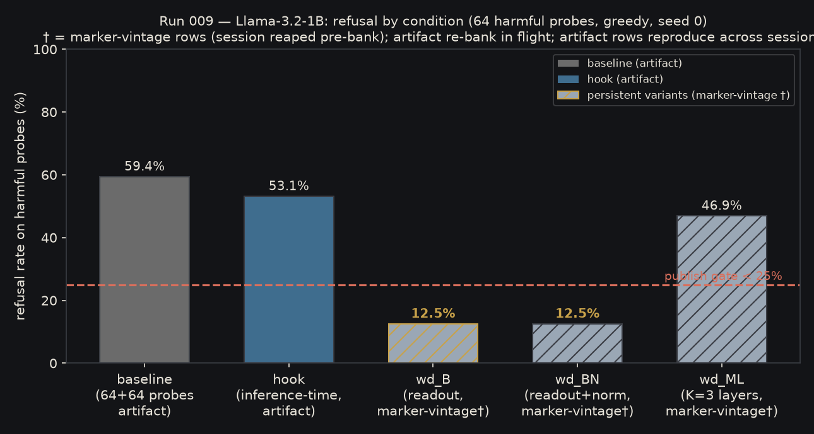
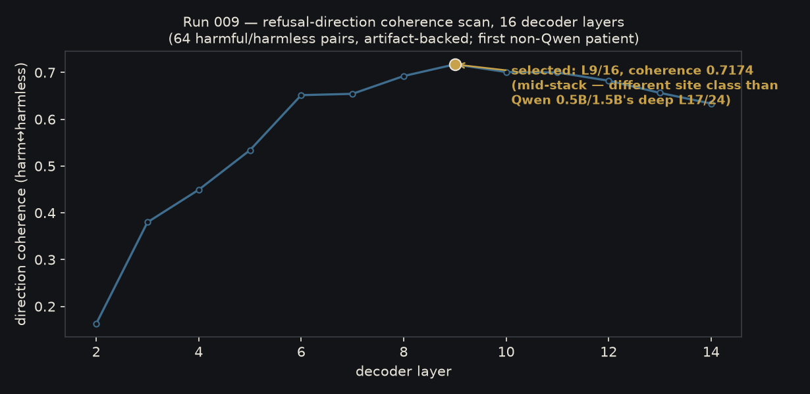
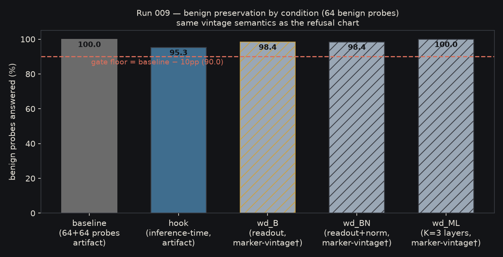

# Llama-3.2-1B-Instruct-abliterated

A refusal-ablated edit of **meta-llama/Llama-3.2-1B-Instruct** (pinned
revision `9213176726f574b556790deb65791e0c5aa438b6`): the readout-space
refusal direction was orthogonalized out of the untied `lm_head` weight,
making the edit **persistent** — no hook required at inference time.
First non-Qwen patient of this engine; the founding direction method
was originally characterized on Llama-2-class models, so this run
measures it back on a modern small Llama.

## What it does

Refusal behavior on a fixed 64-prompt harmful set (greedy, 200 new
tokens, marker-based scorer — identical instrument to this engine's
other patients):

| arm | refused /64 | note |
|---|---|---|
| base Llama-3.2-1B-Instruct | **38 (59.4%)** | artifact-backed; lightest refusal tuning of any patient measured here |
| inference-time hook ablation | 34 (53.1%) | artifact-backed |
| **this variant (wd_B, persistent)** | **8 (12.5%)** † | strongest gate result in this program |

† marker-vintage rows: the ladder session completed but a Colab
session-reaper claimed the runtime before its per-row artifacts were
downloaded; the numbers are from the engine's completed-run payload.
The artifact re-bank run is in flight and this table upgrades to
artifact-backed rows in place (greedy/seed-0 determinism already
verified: baseline reproduced identically across two independent
sessions).



## Direction transfer across architecture families

The refusal direction's layer fingerprint moves with the architecture:
the coherence scan selects a **mid-stack site (layer 9 of 16,
coherence 0.717)** here, versus the deep sites of the Qwen2.5 family
(L17/24). Same method, materially different geometry — the run's main
architecture-dependence datapoint.



## Benign behavior

Benign preservation on the 64-prompt harmless set, same instrument:

| arm | answered /64 |
|---|---|
| base | **64 (100%)** (artifact) |
| hook | 61 (95.3%) (artifact) |
| this variant (wd_B) | 63 (98.4%) † |



## Capability guardrail

MMLU (0-shot, 61 subjects, ≤3.0pp loss limit): **pending the re-bank
window** — deliberately not yet measured as of this card version; the
card updates in place when the measurement lands. No capability claim
is made without the measurement.

## Try it

```python
from transformers import AutoModelForCausalLM, AutoTokenizer
m = AutoModelForCausalLM.from_pretrained(
    "sbussiso/Llama-3.2-1B-Instruct-abliterated", torch_dtype="auto")
t = AutoTokenizer.from_pretrained("sbussiso/Llama-3.2-1B-Instruct-abliterated")
```

## Method

Founding directional-editing recipe (Arditi et al. 2024): 64-pair
contrastive direction extraction → coherence-ranked site selection →
weight-space orthogonalization. This variant (`wd_B`) edits the
`lm_head` readout: W ← W − (W r̂) r̂ᵀ with the untied `lm_head`
(`tie_word_embeddings` true → false, persisted in config). The edit's
disk-verified residual (max |W r̂| = 7.1e-05) matches the GPU-native
edit stream to four significant digits.

## Honest limitations

- Interim measurement record, upgrading in place: per-row artifacts for
  the variant arms land with the re-bank run; MMLU guardrail unmeasured
  as of this version.
- Probe tables are from fixed 64-prompt sets, greedy decoding,
  single-seed, single marker-set scorer — not a benchmark-suite claim.
- Selective-refusal calibration (RefusalBench-style graded refusal) and
  refusal-residual breadth (e.g. SORRY-Bench classes) are not yet run
  on this patient.
- Any post-hoc refusal ablation is recoverable by small benign
  fine-tuning (literature finding; applies to this edit).
- Meta's Llama 3.2 Community License governs the base model and this
  edit; use under that license's terms.

## References

- Arditi, A. et al. 2024. *Refusal in Language Models Is Mediated by a
  Single Direction.* NeurIPS 2024. https://arxiv.org/abs/2406.11717
- Xie, T. et al. 2025. *SORRY-Bench: Systematically Evaluating Large
  Language Model Safety Refusal.* ICLR 2025. (residual-breadth instrument
  queued for this patient)
- Muhamed, A. et al. 2025. *RefusalBench: Generative Evaluation of
  Selective Refusal in Grounded Language Models.* EACL 2026.
  (selective-refusal instrument queued for this patient)
- Malla, S. et al. 2025. *The Geometry of Refusal: Why Post-Hoc Safety
  Is Fragile and Pretraining-Time Safety Persists.*
  https://arxiv.org/abs/2609.06934

## Provenance

- Base weights: `meta-llama/Llama-3.2-1B-Instruct` @
  `9213176726f574b556790deb65791e0c5aa438b6` (gated; access accepted under
  the owner account).
- This variant (wd_B): `tie_word_embeddings` true → false (persisted);
  weights sha256 `6417be31231b76300c7013acccfd30251cc5c105356089a456950e23666e0a9c`
  (deterministic rebuild instance #1 from the shipped direction banks —
  value-hash `740b6a9305fb9388`, file-hash `94adc9777362b34b`); the
  GPU-native artifact from the re-bank window is byte-checked against
  these on landing.
- Direction banks: `refusal_direction_A.npy` (residual-space, ‖d‖ 3.78)
  and `refusal_direction_B.npy` (readout-space, ‖d‖ 74.58) — the run's
  banked stage-A artifacts, shipped for full re-derivability.
- Charts in `charts/` are generated programmatically from the recorded
  probe/coherence artifacts (`make_card_charts.py` ships with the run),
  in the engine's dark house palette; no hand-typed digits.
- Full method + evaluation write-ups: available on request.

## Files

| path | what |
|---|---|
| `model.safetensors` | this variant's weights (wd_B) |
| `config.json`, `generation_config.json`, `tokenizer*`, `chat_template.jinja` | base-derived runtime files (untie persisted) |
| `refusal_direction_A.npy`, `refusal_direction_B.npy` | banked stage-A direction banks |
| `eval/probes_baseline.json`, `eval/probes_hook_ablated.json` | artifact-backed per-row probe records |
| `eval/rebuild_evidence.json` | weights provenance (sha, recipe, edit residuals) |
| `charts/*.png` | the three figures embedded above |

This is a **research artifact**. It is not a product and is not
intended for production use.